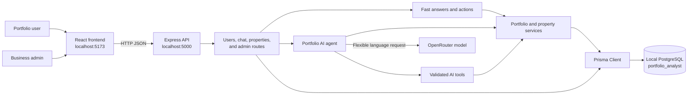
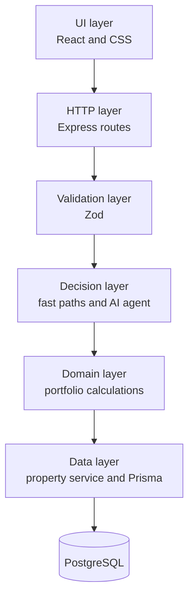
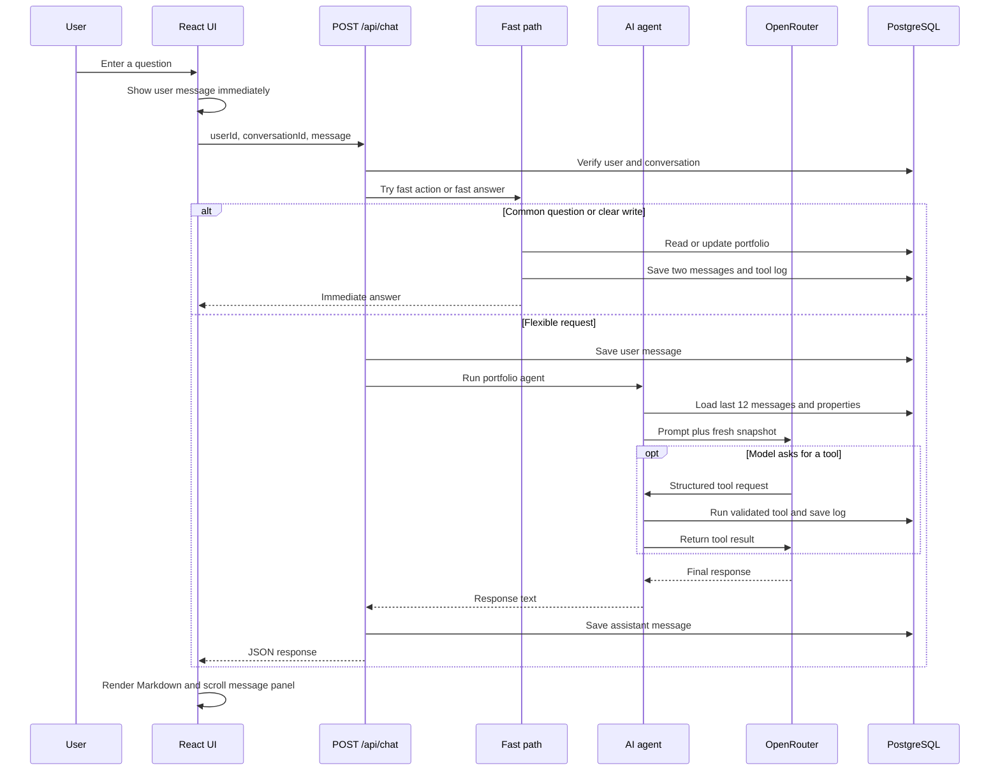
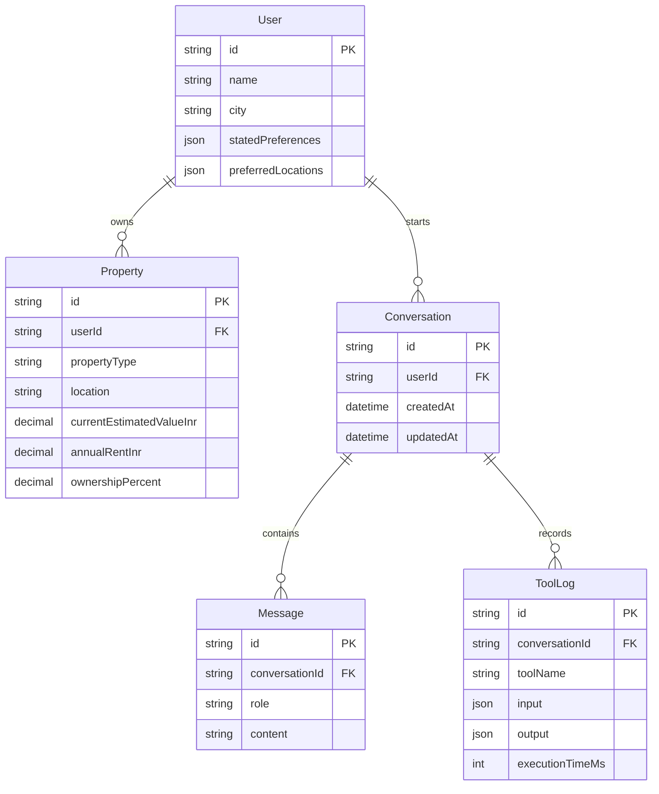

# Chirag's Complete Beginner Guide to EstateIQ

This document explains the complete AI Real Estate Portfolio Analyst project from the beginning. It is written for someone who is new to TypeScript, React, Express, PostgreSQL, Prisma, APIs, and AI tool calling.

The guide explains:

- what the application does;
- how to install and run it without Docker;
- how information moves from the browser to PostgreSQL and back;
- why the project has a frontend, backend, database, fast paths, and AI path;
- what every project-owned file does;
- what the important functions, types, routes, tests, and styles mean;
- how to debug and safely extend the system.

Do not commit the real `.env` file. It contains the local database password and OpenRouter API key.

## Table of contents

1. [What this project does](#1-what-this-project-does)
2. [The technology stack](#2-the-technology-stack-in-simple-words)
3. [The complete architecture](#3-the-complete-architecture)
4. [Project folder map](#4-project-folder-map)
5. [Run the project from zero](#5-run-the-project-from-zero)
6. [Chat request flow](#6-what-happens-when-a-user-sends-a-chat-message)
7. [Database design](#7-database-design)
8. [Portfolio formulas](#8-portfolio-formulas)
9. [Root files](#9-root-files-explained)
10. [Backend configuration](#10-backend-configuration-and-database-files)
11. [Backend foundation](#11-backend-foundation-files)
12. [Services](#12-service-layer-explained)
13. [Fast paths](#13-fast-answer-and-fast-action-code)
14. [AI agent](#14-ai-agent-explained)
15. [AI tools](#15-ai-tools-explained)
16. [API routes](#16-api-routes-explained)
17. [Frontend](#17-frontend-files-explained)
18. [Dataset](#18-dataset-files-explained)
19. [Scripts](#19-scripts-explained)
20. [Tests](#20-tests-explained)
21. [API examples](#21-api-examples-for-learning)
22. [Security](#22-how-security-and-data-isolation-work)
23. [Performance](#23-performance-behavior)
24. [Debugging](#24-common-problems-and-how-to-debug-them)
25. [Modification recipes](#25-safe-modification-recipes)
26. [TypeScript syntax](#26-reading-typescript-syntax-used-in-this-project)
27. [Learning order](#27-suggested-learning-order)
28. [Final mental model](#28-final-mental-model)

---

## 1. What this project does

EstateIQ is a web application for viewing and managing real estate portfolios through a chat interface.

A user can:

- select one of the four portfolio owners;
- ask for total portfolio value;
- list and filter properties;
- calculate annual rent and gross rental yield;
- compare residential, retail, and office holdings;
- check occupancy and concentration risks;
- run a hypothetical property exclusion without changing the database;
- add a property using natural language;
- update a property's value, rent, ownership percentage, or occupancy;
- reopen earlier conversations.

A business administrator can:

- enter the business password;
- see users and conversation counts;
- inspect every saved message;
- inspect tool inputs, outputs, and execution time;
- see conversations that contain repeated errors.

The application uses deterministic TypeScript code for common questions and clear property changes. OpenRouter is used for questions that require flexible language reasoning. This design makes common operations fast and keeps database changes validated.

---

## 2. The technology stack in simple words

| Technology | Beginner explanation | Where it is used |
| --- | --- | --- |
| HTML | The basic page loaded by the browser. | `frontend/index.html` |
| CSS | Controls layout, colors, spacing, mobile behavior, and animation. | `frontend/src/styles.css` |
| JavaScript | The programming language executed by browsers and Node.js. | Generated from TypeScript |
| TypeScript | JavaScript with type checking. It catches many mistakes before the app runs. | Frontend and backend source |
| React | Builds the interface from components and updates it when state changes. | `frontend/src/main.tsx` |
| Vite | Runs the frontend development server and creates the production frontend bundle. | `frontend/vite.config.ts` |
| Node.js | Executes JavaScript and TypeScript outside the browser. | Backend and scripts |
| Express | Receives HTTP requests and sends JSON responses. | Backend routes |
| PostgreSQL | Stores users, properties, conversations, messages, and logs permanently. | Local database |
| Prisma | Lets TypeScript read and write PostgreSQL using JavaScript objects. | Backend database layer |
| Zod | Validates incoming values before code uses or saves them. | Routes, property service, AI tools |
| LangChain | Connects the backend to the OpenRouter chat model and defines structured AI tools. | Agent and tools |
| OpenRouter | Sends flexible questions to an AI model. | Questions outside the deterministic fast path |
| Vitest | Runs automated tests. | `*.test.ts` files |
| PowerShell | Automates local PostgreSQL setup on Windows. | `scripts/setup-local-db.ps1` |

### Important beginner terms

- **Frontend:** code that runs in the browser and displays the interface.
- **Backend:** code that runs on the server and owns business rules and database access.
- **API:** URLs the frontend calls to ask the backend for data or an operation.
- **Route:** backend code connected to a specific HTTP method and URL.
- **JSON:** a text format used to exchange structured data.
- **Database table:** stored rows with named columns.
- **Schema:** the formal definition of database tables and relationships.
- **Migration:** versioned SQL that creates or changes the schema.
- **Component:** a React function that returns part of the interface.
- **State:** data remembered by a React component while the page is open.
- **Hook:** a React function such as `useState` or `useEffect`.
- **Promise:** a JavaScript object representing work that finishes later.
- **`async` / `await`:** syntax for waiting for a Promise without deeply nested callbacks.
- **Tool calling:** the model requests a named backend function with validated arguments.
- **Fast path:** deterministic code that answers without waiting for the model.

---

## 3. The complete architecture



The browser never connects directly to PostgreSQL or OpenRouter. It talks only to the Express backend. This keeps credentials and database rules away from browser users.

### Layers and their responsibilities



Keeping these responsibilities separate makes the system easier to test. For example, portfolio formulas can be tested without starting a browser or calling OpenRouter.

---

## 4. Project folder map

```text
New folder/
├── backend/
│   ├── prisma/
│   │   ├── migrations/202609220001_init/migration.sql
│   │   ├── migrations/migration_lock.toml
│   │   ├── schema.prisma
│   │   └── seed.ts
│   ├── src/
│   │   ├── agents/
│   │   ├── db/
│   │   ├── middleware/
│   │   ├── routes/
│   │   ├── services/
│   │   ├── tools/
│   │   ├── utils/
│   │   ├── server.ts
│   │   └── types.ts
│   ├── package.json
│   ├── prisma.config.ts
│   └── tsconfig.json
├── dataset/
│   ├── users.csv
│   ├── properties.csv
│   ├── sample_requests.csv
│   ├── DATASET.md
│   └── README.md
├── frontend/
│   ├── src/main.tsx
│   ├── src/styles.css
│   ├── src/vite-env.d.ts
│   ├── index.html
│   ├── package.json
│   ├── vite.config.ts
│   └── tsconfig*.json
├── scripts/
│   ├── benchmark.mjs
│   └── setup-local-db.ps1
├── .env
├── .env.example
├── .gitignore
├── package.json
├── package-lock.json
├── README.md
├── PERFORMANCE.md
├── ARCHITECTURE.md
├── DECISION_LOG.md
├── SOUL.md
├── WALKTHROUGH.md
└── docker-compose.yml
```

`node_modules/`, `backend/dist/`, and `frontend/dist/` are generated directories. They are not handwritten application source.

---

## 5. Run the project from zero

### Requirements

Install:

1. Node.js 20 or newer.
2. PostgreSQL 15 or newer.
3. Git if you want version control.
4. An OpenRouter API key for flexible AI questions.

PostgreSQL must be running on `127.0.0.1:5432`.

### Install JavaScript packages

Open PowerShell in the project root:

```powershell
npm install
```

The root uses npm workspaces, so this one command installs packages for the root, backend, and frontend.

### Prepare local PostgreSQL

```powershell
npm run db:local:setup
```

The script securely asks for the local `postgres` password. It then:

1. verifies the PostgreSQL login;
2. creates `portfolio_analyst` when missing;
3. updates `DATABASE_URL` and `DIRECT_URL` in `.env`;
4. generates Prisma Client;
5. applies the migration;
6. imports the CSV dataset.

To switch the same project to its configured Supabase pooler later, run `npm run db:supabase:setup`, enter the separate Supabase database password, and restart the backend.

### Configure OpenRouter

Open `.env` and set:

```dotenv
OPENROUTER_API_KEY=your-real-key
OPENROUTER_MODEL=nex-agi/nex-n2.5-mini:free
```

Do not place quotes around the key unless the key actually contains spaces. Restart the backend after changing `.env`.

### Start both applications

```powershell
npm run dev
```

Open:

- frontend: `http://localhost:5173`
- backend health check: `http://localhost:5000/health`

The Portfolio AI login uses `USER_PASSWORD`, and the Business page additionally uses `ADMIN_PASSWORD`. The development value requested for both is `1234`.

### Build and test

```powershell
npm test
npm run build
```

`npm test` runs the backend tests. `npm run build` type-checks both applications and creates production output.

---

## 6. What happens when a user sends a chat message



### Why there are multiple response paths

Calling a remote AI model for `What is my total portfolio value?` is unnecessary. TypeScript can calculate the exact answer faster and more reliably. The app therefore checks in this order:

1. **Fast action:** clear add or update instruction.
2. **Fast answer:** common read, comparison, risk, or scenario question.
3. **AI agent:** flexible language that deterministic patterns do not cover.

All paths use current database records. The fast path is not hard-coded to one user's totals.

---

## 7. Database design



### `User`

One row represents one portfolio owner. IDs such as `U001` come from the supplied dataset. A user has many properties and conversations.

### `Property`

One row represents one holding. Money uses PostgreSQL `DECIMAL`, which avoids floating-point storage errors. `userId` links the property to its owner.

### `Conversation`

Groups multiple chat messages. `updatedAt` is used to sort recent conversations.

### `Message`

Stores either a `user` or `assistant` turn. Saving messages makes conversations available after a page refresh.

### `ToolLog`

Stores which deterministic function or AI tool ran, its input, output, and duration. This is useful for debugging and the Business dashboard.

### Foreign keys and cascade deletion

A foreign key prevents a child row from pointing at a missing parent. `onDelete: Cascade` means deleting a user also deletes that user's properties and conversations. Deleting a conversation deletes its messages and tool logs.

### Indexes

Indexes speed up frequent searches:

- properties by `userId`;
- properties by `location`;
- conversations by user and update time;
- messages and logs by conversation and creation time.

---

## 8. Portfolio formulas

### Owned value

The app respects partial ownership:

```text
owned value = estimated property value × ownership percentage / 100
```

Example: a ₹2 crore property with 50% ownership contributes ₹1 crore to the user's portfolio.

### Owned annual rent

```text
owned annual rent = annual rent × ownership percentage / 100
```

### Total portfolio value

```text
total value = sum of every property's owned value
```

### Gross rental yield

```text
gross yield % = total owned annual rent / total owned value × 100
```

If total value is zero, yield is returned as `null` because division by zero is invalid.

### Occupancy rate

```text
occupancy rate % = occupied or tenanted property count / total property count × 100
```

Vacant, self-occupied, and unknown records are counted separately.

---

## 9. Root files explained

### `package.json`

This is the main npm configuration.

- `private: true` prevents accidental publication to npm.
- `workspaces` tells npm that `backend` and `frontend` are parts of one project.
- `dev` starts both applications with `concurrently`.
- `build` builds backend first and frontend second.
- `test` runs backend tests.
- `db:*` forwards database commands into the backend workspace.
- `db:local:setup` launches the secure Windows setup script.
- `engines.node` documents the minimum Node version.

### `package-lock.json`

This generated file records exact dependency versions and integrity hashes. It makes installs repeatable. Commit it, but normally change it only through `npm install` or `npm uninstall`.

### `.env`

The real environment file contains local secrets and machine-specific settings. Backend startup, Prisma, and Vite read values from it. It is ignored by Git. Never copy its actual password or API key into documentation.

### `.env.example`

This safe template shows the required variable names:

- `DATABASE_URL`: Prisma Client connection.
- `DIRECT_URL`: migration connection.
- `OPENROUTER_API_KEY`: private model credential.
- `OPENROUTER_MODEL`: selected OpenRouter model.
- `USER_PASSWORD`: protects the Portfolio AI screen and portfolio APIs.
- `ADMIN_PASSWORD`: protects admin routes.
- `PORT`: backend port.
- `CORS_ORIGIN`: browser origin accepted by Express.
- `VITE_API_BASE_URL`: optional frontend API base URL.

### `.gitignore`

This prevents dependencies, build output, coverage, `.env`, and log files from entering Git.

### Existing documentation files

- `README.md`: main setup, operations, API, and deployment guide.
- `ARCHITECTURE.md`: compact architecture description.
- `DECISION_LOG.md`: important implementation decisions and tradeoffs.
- `PERFORMANCE.md`: latency measurements and scaling ideas.
- `WALKTHROUGH.md`: short demonstration flow.
- `SOUL.md`: product behavior and response principles.
- `CHIRAG.md`: this beginner-level code guide.

### `docker-compose.yml`

This optional file describes a PostgreSQL 16 container. The current project uses locally installed PostgreSQL, so it is not needed for normal startup. It remains as an optional future environment definition.

---

## 10. Backend configuration and database files

### `backend/package.json`

Important scripts:

- `tsx watch src/server.ts`: run TypeScript directly and restart after edits.
- `tsc -p tsconfig.json`: compile TypeScript into `backend/dist`.
- `node dist/server.js`: run compiled production code.
- `vitest run`: execute tests once.
- `prisma generate`: generate the typed Prisma Client.
- `prisma migrate deploy`: apply committed migrations.
- `tsx prisma/seed.ts`: import dataset CSV files.

Important dependencies:

- `express` and `cors` for HTTP;
- `dotenv` for `.env`;
- `zod` for validation;
- Prisma packages for PostgreSQL;
- LangChain packages for OpenRouter and tool calling;
- `csv-parse` for seed data.

### `backend/tsconfig.json`

- targets modern ES2022 JavaScript;
- uses Node's ESM module rules;
- reads code from `src`;
- writes compiled files into `dist`;
- enables strict type checking;
- checks file-name capitalization consistently.

### `backend/prisma.config.ts`

This loads the root `.env` before Prisma commands run and points Prisma at `prisma/schema.prisma`.

`fileURLToPath(new URL(..., import.meta.url))` builds an absolute path relative to this file. This works even when the terminal starts from a different folder.

### `backend/prisma/schema.prisma`

This is the source of truth for the database models. `generator client` enables Prisma Client generation. `datasource db` selects PostgreSQL and reads both database URLs from the environment.

`?` after a type means the column may be `null`. `[]` means a one-to-many relationship. `@id` marks a primary key. `@default(now())` inserts the current time. `@updatedAt` lets Prisma refresh the timestamp automatically.

### `backend/prisma/migrations/202609220001_init/migration.sql`

This is the SQL form of the initial schema. It creates all five tables, primary keys, indexes, and foreign keys. Prisma records applied migrations so the same migration is not run twice.

### `backend/prisma/migrations/migration_lock.toml`

This generated Prisma file records that the migration provider is PostgreSQL. Do not manually change it during ordinary development.

### `backend/prisma/seed.ts`

The seed script:

1. loads `.env`;
2. locates the `dataset` folder;
3. checks that required CSV files exist;
4. parses CSV rows with column headings;
5. converts blank strings to `null`;
6. converts money and numeric text to numbers;
7. upserts users;
8. upserts properties;
9. disconnects Prisma.

An **upsert** means “update if this ID exists, otherwise create it.” It allows the seed command to run more than once without duplicating the original IDs.

---

## 11. Backend foundation files

### `backend/src/server.ts`

This is the backend entry point.

Execution order:

1. Load the root `.env`.
2. Create the Express application.
3. Choose `PORT`, defaulting to `5000`.
4. Enable CORS for the configured frontend origin.
5. Enable JSON body parsing with a 64 KB limit.
6. Register `/health` and the user-login route.
7. Protect portfolio routes with `requireUserPassword`.
8. Mount the chat, user, property, and admin routers.
9. Register the central error handler last.
10. Begin listening for requests.

Middleware order matters. Express sends a request through middleware from top to bottom.

### `backend/src/db/prisma.ts`

This creates and exports one `PrismaClient` instance:

```ts
export const prisma = new PrismaClient();
```

Other files import this shared object instead of creating a new database client for every query.

### `backend/src/types.ts`

`PortfolioProperty` is the application's plain TypeScript representation of a property. Prisma returns `Decimal` objects for decimal columns, while portfolio math needs JavaScript numbers. The service layer converts database records into this type.

### `backend/src/middleware/validate.ts`

`validate(schema)` is a middleware factory. A factory is a function that returns another function.

For every validated request:

1. `safeParse` checks `request.body`;
2. invalid input becomes an `AppError(400, ...)`;
3. valid, cleaned data replaces the original body;
4. `next()` passes control to the route handler.

This prevents malformed requests from reaching business logic.

### `backend/src/utils/errors.ts`

`AppError` carries an HTTP status such as 400, 401, or 404. `errorHandler` converts errors into consistent JSON.

Known `AppError` messages may be returned to the browser. Unexpected errors receive the safe generic message `Something went wrong. Please try again.` and the real error is logged on the server.

---

## 12. Service layer explained

### `backend/src/services/propertyService.ts`

This file is the controlled entrance to property database operations.

#### `propertyInput`

A strict Zod schema for creating a property. It requires:

- non-empty `propertyType`;
- non-empty `location`;
- positive `currentEstimatedValueInr`.

Optional numbers have sensible limits. Ownership must be from 0 to 100. `.strict()` rejects unknown fields.

#### `propertyChanges`

This is a partial form of `propertyInput`, so every field becomes optional. A refinement requires at least one field, preventing empty update requests.

#### `completeAgentPropertyInput`

The public property API can still use `propertyInput`, but the AI add tool uses this stricter schema. Before the agent can save a new property it must supply type, subtype or null, location, area, estimated value, purchase price or null, annual rent or null, occupancy, tenant status or null, ownership percentage, and record status. This prevents incomplete AI-created rows.

#### `mapProperty`

Converts Prisma decimal fields into JavaScript numbers and preserves `null`. All calculation code receives a consistent `PortfolioProperty`.

#### Read functions

- `getUserPortfolio(userId)`: gets the user profile.
- `getUserProperties(userId)`: gets all properties belonging to one user.
- `getPropertyById(userId, id)`: requires both the owner and property ID.
- `findMatchingProperties(userId, query)`: matches query terms against ID, location, type, and subtype.

#### Write functions

- `addProperty`: validates input and adds the current `userId`.
- `updateProperty`: validates changes and uses both `id` and `userId` in the update condition.
- `deleteProperty`: checks ownership before deletion.

Including `userId` in every operation prevents one user from changing another user's property.

### `backend/src/services/portfolioService.ts`

This contains pure portfolio math. A pure function depends only on its arguments and does not access the database or network.

- `normalizePropertyType` maps detailed labels into `RESIDENTIAL`, `COMMERCIAL`, or `OTHER`.
- `ownedValue` applies ownership percentage.
- `ownedRent` applies ownership percentage to rent.
- `calculateTotalPortfolioValue` uses `reduce` to add owned values.
- `calculateAnnualRent` sums owned rent.
- `calculateRentalYield` calculates gross yield.
- `calculateValueByType` groups owned value.
- highest and lowest helpers sort copies of the input array.
- `getPropertiesByCity` performs case-insensitive location matching.
- `getOccupancyStats` counts statuses.
- `comparePropertyTypes` builds residential and commercial summaries.
- `getPortfolioSummary` combines all important results into one object.

`[...properties]` creates a shallow copy before sorting so the original array order is not changed.

### `backend/src/services/scenarioService.ts`

`excludePropertyScenario` models the removal of exactly one property in memory.

It:

1. turns the query into useful words;
2. finds matching properties;
3. returns an explanation if zero or multiple properties match;
4. creates a filtered array without the selected property;
5. compares actual and hypothetical summaries;
6. returns `databaseModified: false`.

No Prisma write is present, so the scenario cannot change stored data.

---

## 13. Fast answer and fast action code

### `backend/src/agents/fastActions.ts`

This handles clear natural-language writes without an AI round trip.

#### `parseInrAmount`

It removes commas, extracts a number and optional Indian unit, then converts:

- crore or `cr` to `number × 10,000,000`;
- lakh, lac, or their plurals to `number × 100,000`;
- plain INR to the original number.

#### `parsePortfolioAction`

Regular expressions recognize:

- add property instructions;
- estimated value updates;
- annual rent updates;
- ownership percentage updates;
- occupancy updates.

It returns a structured object or `null`. Returning `null` tells the caller that this message needs another path.

#### `executeFastAction`

This parses clear update instructions and calls `updateProperty`. New properties deliberately do not use the fast action because the agent must collect a complete record first. An update succeeds only when the property ID is owned by the active user or the text matches exactly one owned property.

Ambiguous matching returns a clarification message and does not change anything.

### `backend/src/agents/fastAnswers.ts`

This handles frequent read questions with current database records.

It normalizes case and ending punctuation, rejects write-like messages, and then checks patterns for:

- total value;
- portfolio overview;
- property count and locations;
- concentration and vacancy risks;
- retail or general property lists;
- value thresholds;
- highest annual rent;
- occupancy;
- retail versus office comparison;
- residential versus commercial comparison;
- hypothetical exclusion.

Every successful result includes an `intent` for logging and an `answer` for the user. Markdown such as `**value**` is rendered by the frontend rather than displayed as stars.

---

## 14. AI agent explained

### `backend/src/agents/prompts.ts`

`SYSTEM_PROMPT` gives the model its role and boundaries. It tells the model to:

- stay concise;
- use the fresh portfolio snapshot;
- avoid inventing values;
- convert crore and lakh before tools;
- require essential property fields;
- make writes only after explicit requests;
- identify exactly one property before updating;
- label hypothetical results;
- avoid unsupported financial advice.

The prompt guides the model, while Zod and user-scoped services provide code-level enforcement.

### `backend/src/agents/portfolioAgent.ts`

This is the central reasoning coordinator.

#### Provider fallback

`MODEL_TIMEOUT_MS` is 30 seconds. OpenRouter gets one retry for transient network failures. If the provider remains unavailable, `providerFallback` returns a current property count and owned value instead of leaking an aborted-request error.

#### `writeConfirmation`

This reads a successful tool's JSON and creates a trusted confirmation from the saved record. The model does not get a chance to invent the final amount after a write.

#### `runPortfolioAgent`

The function performs these steps:

1. Try a fast action.
2. Load the last 12 messages and all current properties in parallel.
3. Try a fast answer.
4. Check that OpenRouter configuration exists.
5. Build a fresh snapshot with summary, type comparison, records, owned values, rent, and yield.
6. Create seven tools bound to the active user and conversation.
7. Configure `ChatOpenAI` with OpenRouter's base URL.
8. Detect whether the message may need tools.
9. Convert stored messages into LangChain message objects.
10. Allow at most three model passes.
11. Execute requested tools and append `ToolMessage` results.
12. Return a final answer or safe fallback.

The active `userId` is supplied by backend context, not chosen by the model. That is a major data-isolation control.

---

## 15. AI tools explained

### `backend/src/tools/portfolioTools.ts`

`wrapped` is a reusable tool constructor. It records start time, runs a function, saves input/output/duration, and turns the result into JSON text for the model. Errors are also logged and returned as structured JSON.

`createPortfolioTools(context)` builds a new tool set for one user:

| Tool name | What it does | Writes data? |
| --- | --- | --- |
| `get_portfolio` | Gets profile and portfolio summary. | No |
| `search_properties` | Filters holdings and calculates owned metrics. | No |
| `compare_property_types` | Compares residential and commercial groups. | No |
| `get_highest_rent_property` | Finds the highest-rent holding. | No |
| `add_property` | Requires a complete record, verifies explicitly stated type and value, then creates a property. | Yes |
| `update_property` | Finds exactly one property and validates changes. | Yes |
| `run_portfolio_scenario` | Calculates an exclusion scenario in memory. | No |

The names requested earlier map to the code as follows:

| Requested name | Project implementation |
| --- | --- |
| `addProperty` | `propertyService.ts`, exposed as `add_property` |
| `findMatchingProperties` | `propertyService.ts`, used by `update_property` |
| `getUserPortfolio` | `propertyService.ts`, used by `get_portfolio` |
| `getUserProperties` | `propertyService.ts`, used throughout tools |
| `propertyChanges` | Zod update schema |
| `propertyInput` | Zod create schema |
| `updateProperty` | User-scoped database update |

Every user receives the same tool names. The bound `context.userId` changes which records the tools can access.

---

## 16. API routes explained

### `backend/src/routes/users.ts`

`POST /api/auth/user-login` validates the Portfolio AI password. `GET /api/users` requires the `x-user-password` header and returns only safe selector fields: ID, name, and city.

### `backend/src/routes/properties.ts`

| Method and URL | Purpose |
| --- | --- |
| `GET /api/properties?userId=U001` | List one user's properties. |
| `GET /api/properties/P001?userId=U001` | Get one owned property. |
| `POST /api/properties` | Validate and create a property. |
| `PATCH /api/properties/P001` | Validate and update an owned property. |
| `DELETE /api/properties/P001?userId=U001` | Delete an owned property. |

Route handlers use `try/catch` and pass failures to `next(error)`, which reaches the central error handler.

### `backend/src/routes/chat.ts`

This is the largest backend route because it coordinates validation, users, conversations, fast paths, the agent, persistence, and logging.

#### Conversation reads

- `GET /api/chat/conversations?userId=...` returns the latest 30 conversations for that user.
- `GET /api/chat/conversations/:id?userId=...` returns messages only when both conversation ID and user ID match.

#### `persistImmediate`

This saves the user message, assistant answer, and tool log together through a nested Prisma write. It creates a new conversation or updates an existing conversation owned by the user.

#### `POST /api/chat`

The body schema requires:

```json
{
  "userId": "U001",
  "message": "What is my total portfolio value?",
  "conversationId": "optional-existing-id"
}
```

The route:

1. determines whether the message might have a fast answer;
2. parses a possible fast action;
3. loads user, conversation, and possibly properties in parallel;
4. rejects missing users or cross-user conversations;
5. runs the fast action or fast answer when possible;
6. otherwise creates or resumes a conversation;
7. saves the user message;
8. calls `runPortfolioAgent`;
9. converts unexpected agent errors into safe text;
10. saves the assistant response;
11. updates conversation time;
12. logs total request latency;
13. returns JSON to the frontend.

### `backend/src/routes/admin.ts`

`POST /api/admin/login` checks the submitted password. All later admin routes require the same value in the `x-admin-password` header.

Protected endpoints return:

- users and their record counts;
- conversation summaries;
- a full conversation with messages and tool logs;
- the most recent 200 tool logs;
- conversations that need attention.

The browser stores the password in `sessionStorage`, which is cleared when the tab session ends or the user presses Lock. For a larger production system, replace this shared password with user accounts, password hashing, sessions, roles, and audit events.

---

## 17. Frontend files explained

### `frontend/package.json`

This defines the browser application's commands and packages.

- `vite` runs development and production bundling.
- `react` and `react-dom` provide components, hooks, and browser rendering.
- `react-markdown` safely turns assistant Markdown into React elements.
- `@vitejs/plugin-react` connects React's JSX transform to Vite.
- Type packages teach TypeScript about React and browser APIs.

The `dev`, `build`, and `preview` scripts respectively start development, create production output, and locally serve the finished bundle.

### `frontend/index.html`

The browser first loads this small HTML file. `<div id="root"></div>` is an empty mounting point. The module script loads `src/main.tsx`, and React fills the root element.

### `frontend/src/vite-env.d.ts`

This one reference line gives TypeScript the Vite-specific types, including `import.meta.env`.

### `frontend/vite.config.ts`

The React plugin transforms JSX. During development, Vite proxies `/api` and `/health` to the backend at `127.0.0.1:5000`. Therefore frontend code can call `/api/users` without dealing with a different port.

### Frontend TypeScript configurations

- `tsconfig.json` connects the app and Vite configurations.
- `tsconfig.app.json` checks browser code, DOM APIs, and React JSX.
- `tsconfig.node.json` checks `vite.config.ts` as Node-side code.
- `noEmit: true` means TypeScript checks code while Vite performs the actual bundle output.

### `frontend/src/main.tsx`

This file contains the application components.

#### Shared types

`User`, `Message`, `ToolLog`, and `Conversation` describe the JSON expected from the backend. These are compile-time checks and do not replace backend validation.

#### `requestJson`

This generic helper calls the backend, parses JSON, throws the backend error message for non-success status codes, and returns a typed result.

#### `MessageBody`

User text is displayed as plain text. Assistant text is passed through `ReactMarkdown`, so `**bold**`, lists, headings, code, and links render cleanly instead of showing formatting characters.

#### `plainTextPreview`

Conversation titles are only one line. This helper removes Markdown syntax, list markers, repeated whitespace, and link syntax before displaying a compact preview.

#### `Icon`

This component contains small inline SVG path definitions. The union type limits callers to valid names. `aria-hidden="true"` hides decorative graphics from screen readers.

#### `Chat`

Important state:

- `users`: portfolio owners from `/api/users`;
- `userId`: active owner;
- `conversations`: active owner's history;
- `conversationId`: conversation being continued;
- `messages`: visible chat messages;
- `text`: composer contents;
- `busy`: prevents duplicate sends;
- `error`: user-visible failure;
- `messagesPanel`: reference to the scrollable message element.

Effects:

1. The first effect loads users once.
2. The second resets and reloads conversations when the user changes.
3. The third scrolls only the message panel after messages change.

Using `panel.scrollTo` instead of `scrollIntoView` prevents the entire page from jumping upward.

The `send` function performs an optimistic update: it immediately shows the user's message. If the request fails, it removes that temporary message and restores the text so the user can retry.

#### `Admin`

This component loads three protected resources in parallel with `Promise.all`: users, conversations, and attention items. It calculates the total tool count, renders dashboard cards and a table, and opens a detail modal for one conversation.

#### `AdminLogin`

This controlled form submits the password to `/api/admin/login`. It shows an error for a failed login and passes the successful password to `App`.

#### `App`

This top-level component first requires the Portfolio AI password, then switches between chat and admin pages. It stores both demo passwords in `sessionStorage`, opens the separate Business login when needed, and clears both sessions with the main Lock button.

#### Final `createRoot`

```tsx
createRoot(document.getElementById("root")!).render(
  <StrictMode><App /></StrictMode>
);
```

This attaches React to the HTML root. `StrictMode` adds development checks. `!` tells TypeScript that the element definitely exists.

### `frontend/src/styles.css`

The stylesheet is grouped by interface area:

- global colors and typography;
- sticky top navigation;
- shared cards and buttons;
- portfolio sidebar and conversation list;
- fixed-height desktop chat layout;
- contained message scrolling;
- assistant and user message bubbles;
- Markdown content styling;
- animated thinking dots;
- composer and errors;
- admin metrics, table, attention queue, login, and detail modal;
- responsive breakpoints at 1000, 760, and 480 pixels.

Important layout rules:

- `.chat-layout` has a viewport-based height on desktop.
- `.chat-card` and `.messages` use `min-height: 0`, allowing the inner panel to shrink inside a grid or flex layout.
- `.messages` uses `overflow-y: auto`, so chat content scrolls inside the card.
- `overscroll-behavior: contain` keeps scroll movement inside the intended panel.
- mobile rules return the layout to natural page height and place the sidebar below chat.

CSS variables such as `--green` and `--muted` keep colors consistent. Media queries make the dashboard and chat usable on smaller screens.

---

## 18. Dataset files explained

### `dataset/users.csv`

Contains the four demo portfolio owners. The first row is a header naming each column. The seed script maps `user_id` to `User.id` and converts empty optional fields to `null`.

### `dataset/properties.csv`

Contains the original property records, values, rent, occupancy, ownership, and status. `property_id` is stable, so upsert can safely rerun.

### `dataset/sample_requests.csv`

Contains example prompts for demonstrating or evaluating the system. It is reference data and is not imported into PostgreSQL by the seed script.

### `dataset/README.md` and `dataset/DATASET.md`

These explain dataset structure, assumptions, and expected use. Keeping data documentation beside the files helps future developers understand units and missing values.

---

## 19. Scripts explained

### `scripts/setup-local-db.ps1`

This Windows automation script accepts optional database name, user, host, and port parameters.

Important safety and behavior:

- validates the database name with a strict regular expression;
- locates `psql.exe` in PATH or PostgreSQL's installation folder;
- reads the password as a hidden `SecureString`;
- supplies the password to PostgreSQL through temporary `PGPASSWORD`;
- checks whether the database exists before creating it;
- URL-encodes special password characters;
- edits only `DATABASE_URL` and `DIRECT_URL`;
- runs generate, migration, and seed commands;
- clears the temporary password variables in `finally`.

`try/finally` guarantees cleanup even if a Prisma command fails.

### `scripts/setup-supabase.ps1`

This securely switches `.env` from local PostgreSQL to the configured Supabase project. It first checks the password through the session pooler, so an incorrect password leaves `.env` unchanged. It then writes the transaction-pooler runtime URL and session-pooler migration URL, applies migrations, imports the dataset, and clears temporary password values.

### `scripts/benchmark.mjs`

This measures three real chat requests for a selected user. It continues one conversation, records elapsed milliseconds, sorts the measurements, and prints samples, median, and maximum as JSON.

Run it while the app is active:

```powershell
node scripts/benchmark.mjs U001
```

---

## 20. Tests explained

### `fastActions.test.ts`

Checks crore, lakh, and plain INR parsing. It also checks complete add instructions and four update types.

### `fastAnswers.test.ts`

Uses two in-memory properties to verify common questions, ownership-adjusted value, list filtering, scenarios, comparisons, occupancy, risks, and punctuation. It also ensures a mixed write request is sent to the full agent instead of partially answered.

### `writeConfirmation.test.ts`

Checks Indian currency formatting after a tool write and protects against an extra-zero formatting error.

### `portfolioService.test.ts`

Tests owned value, rent, yield, grouping, non-mutating scenarios, occupancy labels, retail/office exposure, and the expected U001 totals from the real CSV.

### `portfolioTools.test.ts`

Creates a tool set for U001 through U004 and verifies that every user receives all seven tools.

These tests focus on calculations, parsing, isolation structure, and behavior that would create incorrect financial answers if broken.

---

## 21. API examples for learning

### Health

```powershell
Invoke-RestMethod http://localhost:5000/health
```

Expected:

```json
{ "status": "ok" }
```

### List users

```powershell
Invoke-RestMethod http://localhost:5000/api/users
```

### Ask a chat question

```powershell
$body = @{
  userId = "U001"
  message = "What is my total portfolio value?"
} | ConvertTo-Json

Invoke-RestMethod `
  -Uri http://localhost:5000/api/chat `
  -Method Post `
  -ContentType "application/json" `
  -Body $body
```

### Continue a conversation

Send the returned `conversationId` with the next message.

### Protected admin request

```powershell
$headers = @{ "x-admin-password" = "1234" }
Invoke-RestMethod http://localhost:5000/api/admin/users -Headers $headers
```

---

## 22. How security and data isolation work

Current safeguards include:

- secrets stay in backend `.env`;
- `.env` is ignored by Git;
- frontend receives no OpenRouter or database credential;
- JSON bodies have a size limit;
- Zod validates create and update values;
- property operations include `userId`;
- conversation reads and updates include `userId`;
- tools receive the active user's ID from backend context;
- admin data endpoints require the password header;
- unexpected server failures return generic messages;
- tool actions and failures are logged;
- scenario calculations do not write data;
- assistant Markdown is rendered without enabling raw HTML.

For a public production deployment, add real authentication, password hashing, secure cookies, authorization roles, rate limiting, CSRF protection where appropriate, secret rotation, HTTPS, database backups, monitoring, and audit retention rules.

---

## 23. Performance behavior

Common deterministic requests normally spend time in:

1. browser-to-local-API communication;
2. PostgreSQL reads;
3. portfolio calculation;
4. conversation and log persistence;
5. JSON response and React rendering.

Flexible model requests additionally include OpenRouter and model generation time.

The project reduces delay by:

- using local PostgreSQL;
- handling common questions without OpenRouter;
- handling clear writes without OpenRouter;
- loading history and properties in parallel;
- loading initial chat dependencies in parallel;
- including fresh data in one model prompt;
- returning trusted write confirmation immediately;
- limiting history to 12 messages;
- limiting model output to 600 tokens;
- setting a 30-second timeout;
- returning a portfolio-aware fallback when the model provider fails.

At much higher volume, add a managed connection pool, API rate limits, pagination, caching for read summaries with invalidation after writes, background analytics, structured tracing, multiple API instances, model-provider fallbacks, and p50/p95/p99 dashboards.

---

## 24. Common problems and how to debug them

### Chat selector is empty

Check:

```powershell
Invoke-RestMethod http://localhost:5000/api/users
```

If it fails, run migrations and seed again.

### Database authentication fails

The local PostgreSQL password inside both URLs must be correct and URL-encoded. Rerun:

```powershell
npm run db:local:setup
```

### Port 5173 is already used

Vite automatically tries another port, but the configured CORS origin expects 5173. Stop the old frontend process and restart once so the frontend returns to 5173.

### Port 5000 is already used

Stop the existing backend or change `PORT` and update the frontend API target.

### AI says it is not configured

Check `OPENROUTER_API_KEY` and `OPENROUTER_MODEL` in `.env`, then restart the backend.

### Model request takes too long

Common supported questions should use the fast path. Flexible questions use OpenRouter and can vary with provider load. The backend waits up to 30 seconds and then returns a current portfolio fallback.

### Visible `**` symbols

Assistant bubbles use `ReactMarkdown`, and conversation previews use `plainTextPreview`. Restart or reload the frontend if an older bundle is still open.

### Chat page jumps

The fixed implementation scrolls `.messages` through its React ref. Do not replace it with `messageEnd.scrollIntoView`, because that can scroll the entire document.

### Prisma generate reports `EPERM`

A running backend may hold the Windows query-engine file. Stop the backend, run `npm run db:generate`, and start it again.

---

## 25. Safe modification recipes

### Add another fast question

1. Add a narrow pattern in `fastAnswers.ts`.
2. Calculate from the supplied `properties` array.
3. Return a unique `intent` and answer.
4. Add a test in `fastAnswers.test.ts`.
5. If the chat route should preload properties, add the phrase to `fastCandidate` in `chat.ts`.

### Add a new property field

1. Add the field to `schema.prisma`.
2. Create a new Prisma migration.
3. Add it to `PortfolioProperty`.
4. Map it in `mapProperty`.
5. Add Zod validation.
6. Add it to seed input if present in CSV.
7. Decide whether tools and AI snapshot need the field.
8. Add meaningful tests.

### Add a new AI tool

1. Write or reuse a service function.
2. Add a `wrapped(...)` entry in `createPortfolioTools`.
3. Give it a clear description and strict Zod schema.
4. Bind all access through `context.userId`.
5. Add its name to `portfolioTools.test.ts`.
6. Update the system prompt only if the model needs a new rule.

### Add a new API route

1. Choose the correct router or create one.
2. Validate input with Zod.
3. Put calculations/database behavior in a service.
4. Throw `AppError` for expected problems.
5. Pass unexpected failures to `next`.
6. Mount a new router in `server.ts` if necessary.

### Add a React component

For small components, it can stay in `main.tsx`. As the frontend grows, move components into files such as `components/Chat.tsx` and keep shared API types in a separate module.

---

## 26. Reading TypeScript syntax used in this project

### Type annotation

```ts
const [busy, setBusy] = useState(false);
```

TypeScript infers that `busy` is boolean.

### Union type

```ts
const [page, setPage] = useState<"chat" | "admin">("chat");
```

`page` can contain only those two strings.

### Optional property

```ts
city?: string;
```

The property may be missing.

### Nullable property

```ts
city: string | null;
```

The property exists but may contain `null`.

### Nullish coalescing

```ts
property.ownershipPercent ?? 100
```

Use ownership percentage unless it is `null` or `undefined`; otherwise use 100.

### Optional chaining

```ts
selectedUser?.name
```

Read `name` only if `selectedUser` exists.

### Array map

```ts
users.map((user) => <option key={user.id}>{user.name}</option>)
```

Transforms each user into one React option.

### Array filter

```ts
properties.filter((property) => property.userId === userId)
```

Returns only matching elements.

### Array reduce

```ts
properties.reduce((sum, property) => sum + ownedValue(property), 0)
```

Combines an array into one total, starting at zero.

### Generic type

```ts
async function requestJson<T>(...): Promise<T>
```

The caller selects the expected result type, such as `User[]`.

### Object spread

```ts
{ ...property, annualRentInr: Number(property.annualRentInr) }
```

Copies the object and replaces one field.

### Destructuring

```ts
const { userId, ...input } = req.body;
```

Extracts `userId` and puts the remaining fields into `input`.

### Regular expression

Patterns between `/.../i` match text. The `i` flag means case-insensitive. Fast action patterns are deliberately narrow so unclear language goes to the model rather than causing an unsafe write.

---

## 27. Suggested learning order

Read and experiment in this sequence:

1. `dataset/users.csv` and `dataset/properties.csv`
2. `backend/prisma/schema.prisma`
3. `backend/src/types.ts`
4. `backend/src/services/portfolioService.ts`
5. `backend/src/services/propertyService.ts`
6. `backend/src/routes/users.ts` and `properties.ts`
7. `backend/src/agents/fastAnswers.ts`
8. `backend/src/agents/fastActions.ts`
9. `backend/src/tools/portfolioTools.ts`
10. `backend/src/agents/portfolioAgent.ts`
11. `backend/src/routes/chat.ts`
12. `backend/src/server.ts`
13. `frontend/src/main.tsx`
14. `frontend/src/styles.css`
15. all test files

After each step, change one small value or add one test. Small experiments are easier to understand than changing multiple layers at once.

---

## 28. Final mental model

Remember the project as six connected ideas:

1. **React displays data and collects user input.**
2. **Express owns all HTTP entry points.**
3. **Zod rejects invalid data.**
4. **Services own database access and portfolio math.**
5. **Fast paths handle clear operations; OpenRouter handles flexible language.**
6. **Prisma stores the result and tool history in PostgreSQL.**

When debugging, follow one request through those layers in order. Check the browser state, network request, route, validation, service, Prisma query, stored record, and final response. That approach works for almost every issue in this application.
